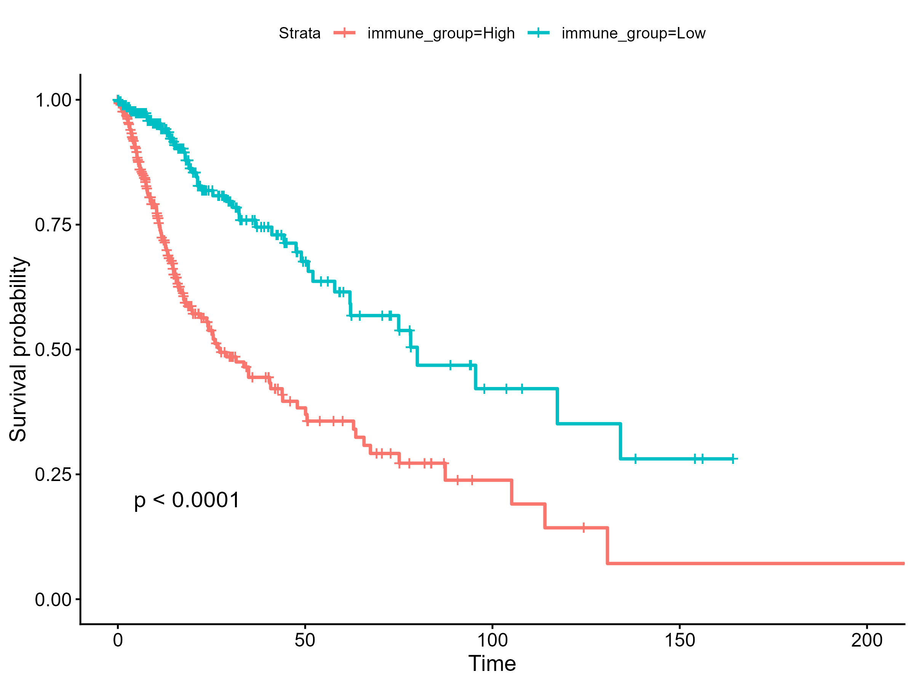
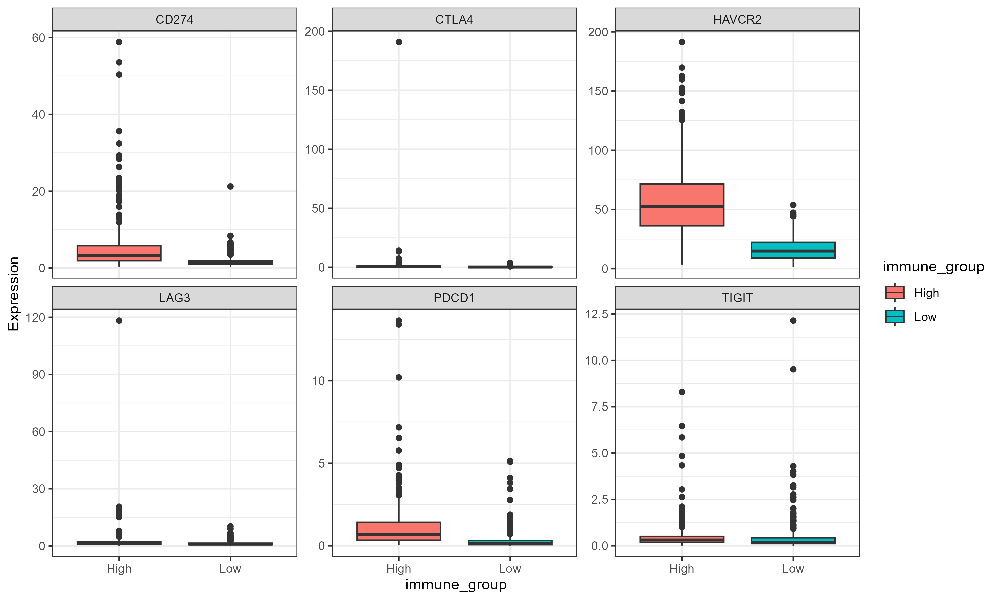
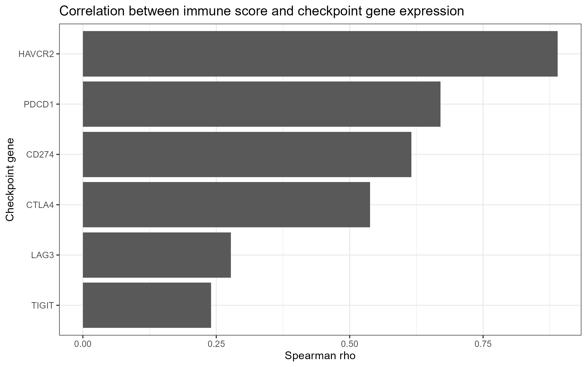
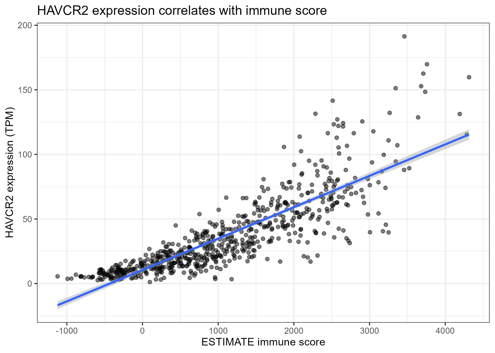
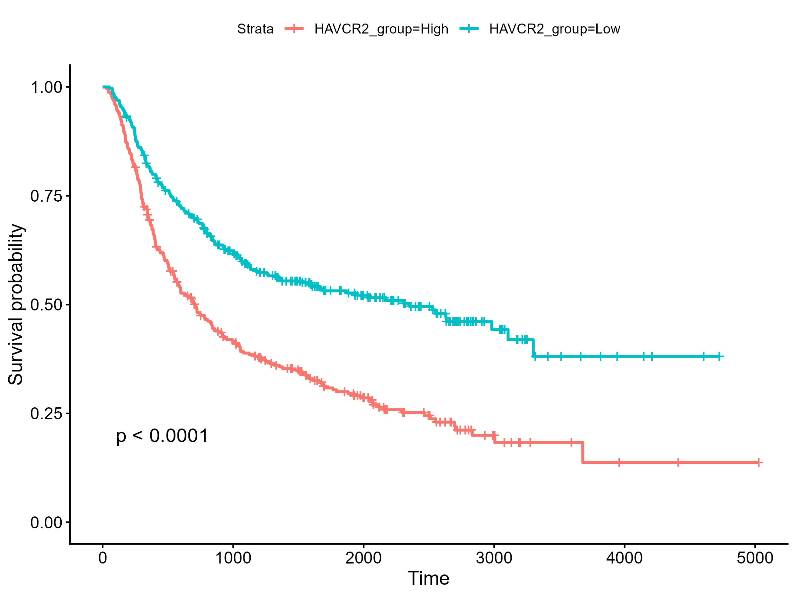
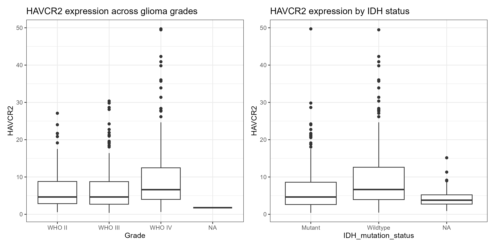
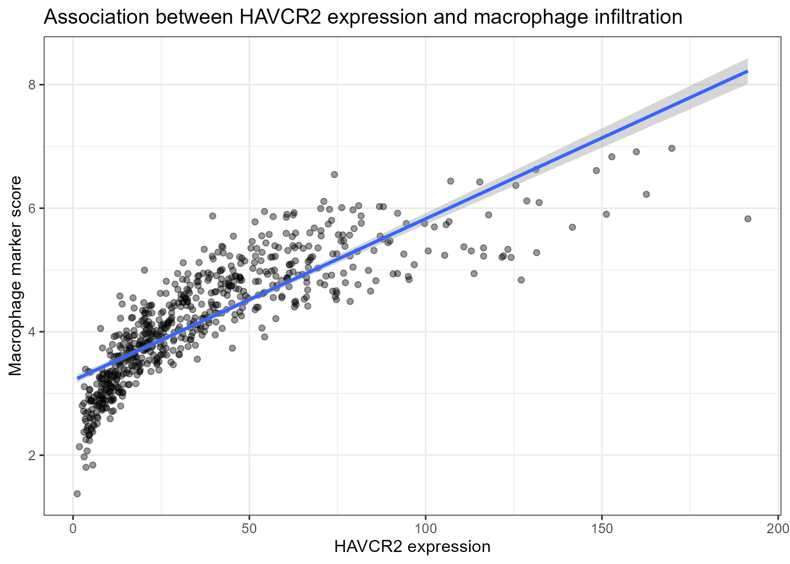
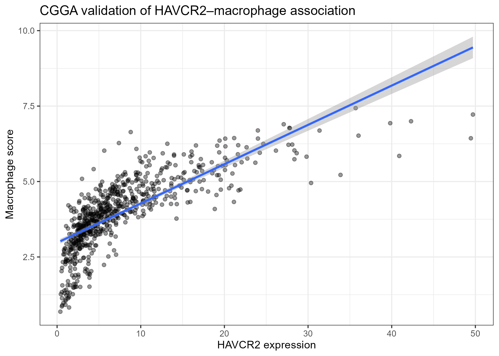

# HAVCR2 Is Associated With Immune Infiltration, Macrophage Enrichment, and Aggressive Glioma Biology

## Overview

This repository contains the code, figures, results, and manuscript associated with an integrated analysis of immune infiltration and immune checkpoint expression in diffuse glioma.

Using transcriptomic and clinical data from The Cancer Genome Atlas (TCGA) and independent validation in the Chinese Glioma Genome Atlas (CGGA), this study identified **HAVCR2 (TIM-3)** as a robust marker of immune activation, macrophage enrichment, and aggressive glioma biology.

## Study Highlights

* High ESTIMATE immune scores were associated with significantly worse overall survival in TCGA gliomas.
* Immune-enriched tumors exhibited increased expression of multiple immune checkpoint genes, including PDCD1, CD274, CTLA4, LAG3, TIGIT, and HAVCR2.
* HAVCR2 showed the strongest association with immune infiltration among all evaluated checkpoint genes.
* Elevated HAVCR2 expression was associated with significantly shorter overall survival in an independent CGGA cohort.
* HAVCR2 expression was significantly higher in WHO grade IV and IDH-wildtype gliomas.
* HAVCR2 demonstrated strong correlations with macrophage infiltration signatures in both TCGA and CGGA cohorts.

## Datasets

### TCGA

* TCGA-LGG (Lower Grade Glioma)
* TCGA-GBM (Glioblastoma)

### CGGA

* CGGA mRNAseq_693 cohort

## Repository Structure

```text
figures/      Manuscript figures
results/      Statistical summary tables
scripts/      R analysis scripts
manuscript/   Manuscript draft
```

## Main Figures

### Figure 1 – Immune score survival analysis (TCGA)



### Figure 2 – Immune checkpoint expression in immune-high and immune-low tumors



### Figure 3 – Correlations between immune score and checkpoint genes



### Figure 4 – Association between HAVCR2 expression and immune score



### Figure 5 – CGGA survival validation



### Figure 6 – HAVCR2 expression by grade and IDH status



### Figure 7 – HAVCR2 and macrophage infiltration in TCGA



### Figure 8 – CGGA validation of the HAVCR2–macrophage association



---

## Key Results

| Finding                                       | Result                                          |
| --------------------------------------------- | ----------------------------------------------- |
| High immune score and survival                | Log-rank p < 0.0001                             |
| Independent prognostic effect of immune score | Multivariable Cox p = 0.014                     |
| Strongest checkpoint–immune score association | HAVCR2 (rho = 0.89)                             |
| HAVCR2–macrophage correlation (TCGA)          | rho = 0.917                                     |
| HAVCR2–macrophage correlation (CGGA)          | rho = 0.860                                     |
| CGGA survival validation                      | Log-rank p < 0.0001                             |
| HAVCR2 univariate Cox (CGGA)                  | HR = 1.035 (95% CI 1.022–1.047), p = 2.6 × 10⁻⁸ |

---

## Reproducibility

Analyses were performed using R version 4.5.2.

Main packages:

* TCGAbiolinks
* SummarizedExperiment
* survival
* survminer
* ggplot2
* dplyr

---

## Data Availability

TCGA data are publicly available through the Genomic Data Commons (GDC):

https://portal.gdc.cancer.gov/

CGGA data are publicly available through the Chinese Glioma Genome Atlas:

http://www.cgga.org.cn/

---

## Manuscript

The manuscript draft is available in the `manuscript/` directory.

## Author

Agata Gabara

## License

This repository is provided for academic and research purposes.

## Citation

If you use this repository, please cite the associated manuscript:

Gabara A. *HAVCR2 Is Associated With Immune Infiltration, Macrophage Enrichment, and Aggressive Glioma Biology: An Integrated TCGA and CGGA Analysis*. Cancer Informatics. (Under review).
